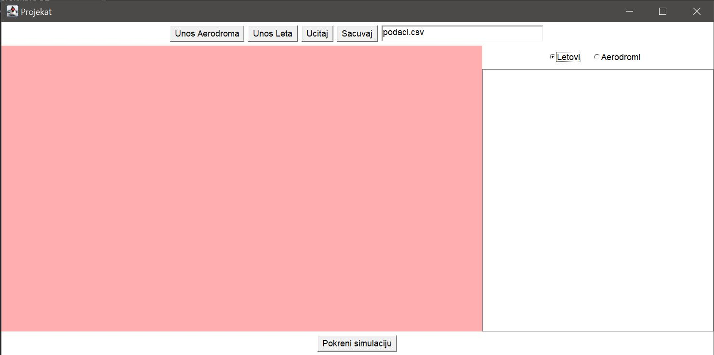
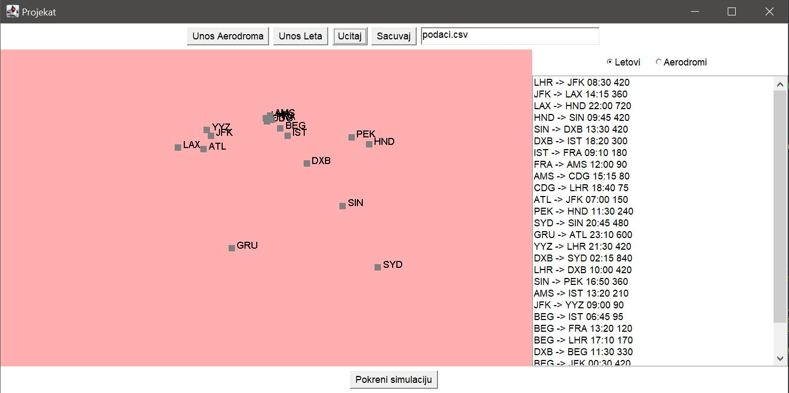
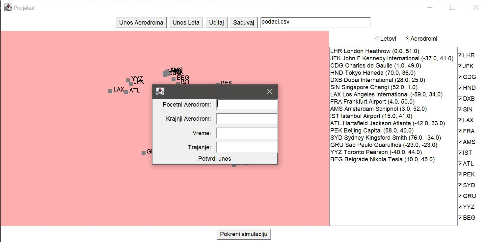
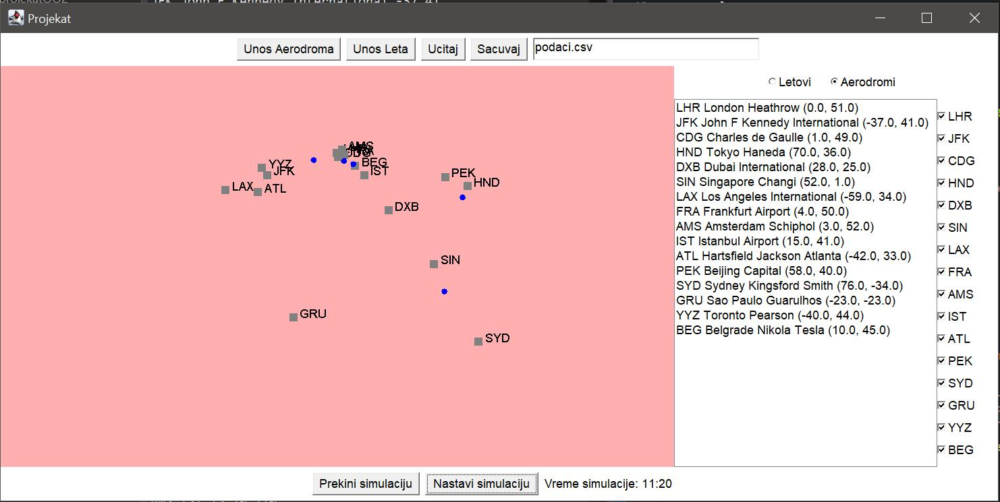
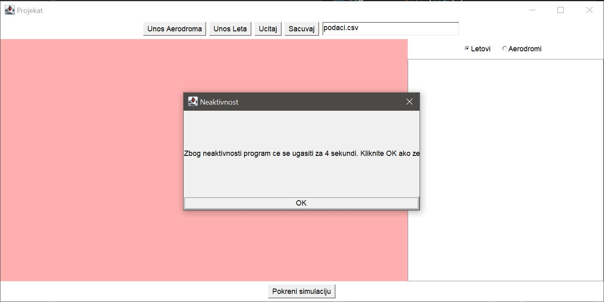

# Flight Traffic Simulation

Java desktop application developed as a university project for the **Object-Oriented Programming 2** course at the **Faculty of Electrical Engineering, University of Belgrade**.

The application simulates air traffic by allowing users to create airports and flights, visualize them on an interactive map, import/export data, and run a real-time flight simulation. The project was implemented using object-oriented programming principles and a graphical user interface.

---

## Features

### Airport Management
- Create new airports
- Validate airport data
- Display airports on an interactive map
- Select and highlight airports
- Show or hide airports using filters

### Flight Management
- Create flights between airports
- Validate flight data
- Display all available flights

### File Support
- Import data from CSV and JSON files
- Export data to CSV and JSON
- Exception handling for invalid files and incorrect input

### Interactive Map
- Airport visualization based on geographical coordinates
- Airport selection with visual highlighting
- Airport filtering
- Automatic map updates

### Flight Simulation
- Real-time aircraft simulation
- Animated aircraft movement
- Simulation pause/resume
- Simulation reset
- Flight scheduling
- Airport departure queue

### Additional Features
- Automatic application shutdown after inactivity
- Countdown warning before closing
- Comprehensive exception handling
- Modular object-oriented architecture

---

## Technologies

- Java
- Java Swing
- Eclipse IDE
- Object-Oriented Programming
- Java Threads
- Timers
- CSV Parsing
- JSON Parsing

---

## Project Structure

```
src/
├── buttoni/        # Custom buttons
├── dijalozi/       # Dialog windows
├── formatter/      # CSV & JSON import/export
├── izuzeci/        # Custom exceptions
├── Objekti/        # Core application logic
└── projekatOO2/    # Main application
```

---

## Screenshots

### Main Window

Application startup screen before loading data.



---

### Airport Map

Visualization of loaded airports and flights.



---

### Airport Selection

Selected airport highlighted on the map.


---

### Flight Creation

Dialog used for creating a new flight.



---

### Flight Simulation

Real-time aircraft movement between airports.



---

### Inactivity Timeout

Automatic shutdown warning after a period of inactivity.



---

## How to Run

1. Clone the repository.

```
git clone https://github.com/YOUR_USERNAME/Flight-Traffic-Simulation.git
```

2. Open the project in **Eclipse IDE**.

3. Run:

```
src/projekatOO2/Main.java
```

---

## Project Requirements

The application was developed in three implementation phases:

- **Phase A**
  - Airport and flight management
  - CSV/JSON import and export
  - Input validation
  - Automatic inactivity timeout

- **Phase B**
  - Interactive airport map
  - Airport filtering
  - Airport selection and highlighting

- **Phase C**
  - Real-time flight simulation
  - Aircraft animation
  - Flight scheduling
  - Multithreading and timers

The complete project specification is available in:

```
docs/OOP2_2026_projekat.pdf
```

---

## Object-Oriented Programming Concepts

This project demonstrates the use of:

- Encapsulation
- Inheritance
- Polymorphism
- Abstraction
- Interfaces
- Exception Handling
- Collections
- GUI Programming
- Multithreading
- Modular software architecture

---

## Author

Aleksandar Savić

Faculty of Electrical Engineering

University of Belgrade

Academic Year: 2025/2026
